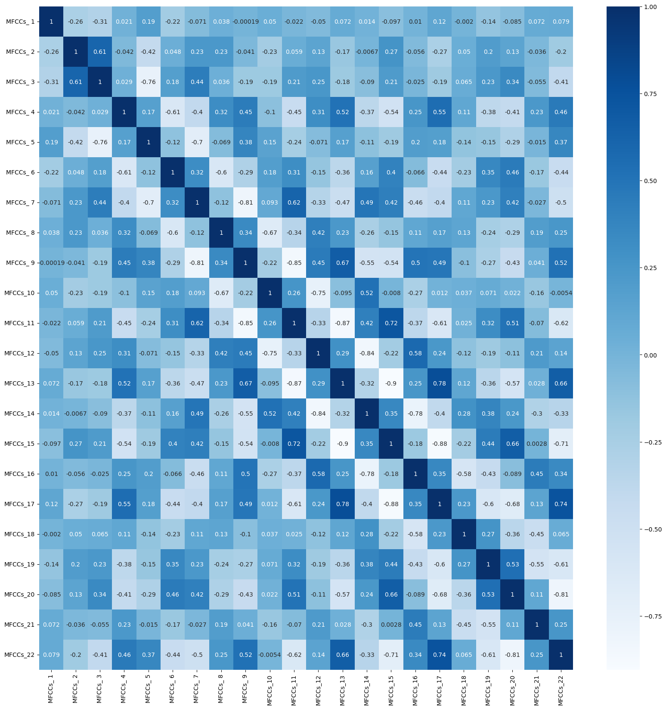
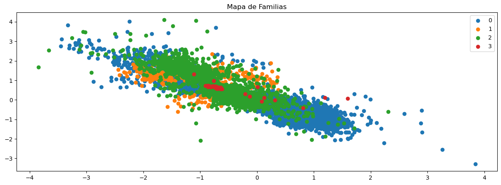
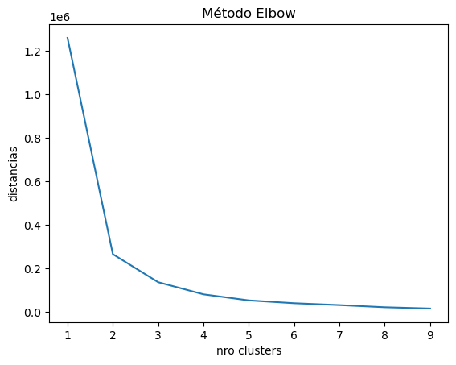
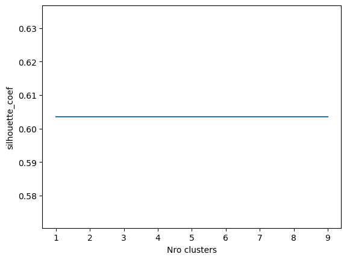
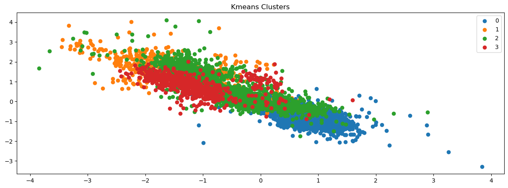
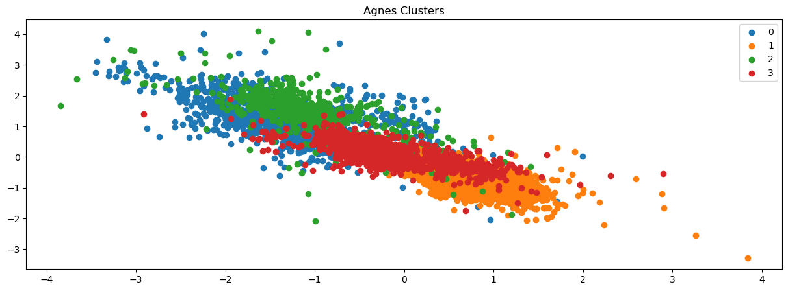
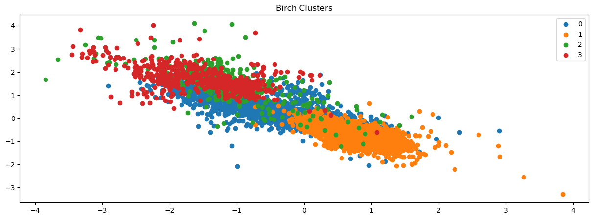
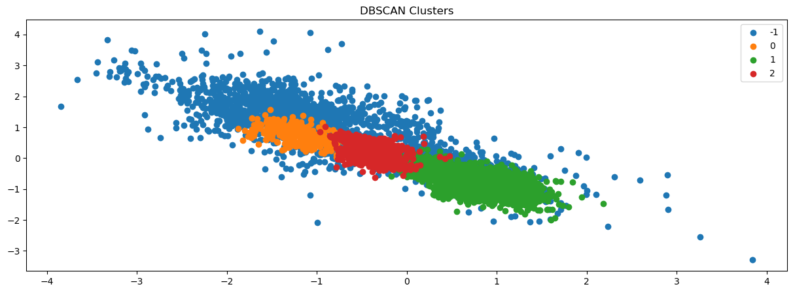

<h1>Aplicacion de modelos no supervisados.<span class="tocSkip"></span></h1>
<div class="toc"><ul class="toc-item"><li><span><a href="#Definicion-del-problema." data-toc-modified-id="Definicion-del-problema.-1"><span class="toc-item-num">1&nbsp;&nbsp;</span>Definicion del problema.</a></span></li><li><span><a href="#Librerías-generales" data-toc-modified-id="Librerías-generales-2"><span class="toc-item-num">2&nbsp;&nbsp;</span>Librerías generales</a></span><ul class="toc-item"><li><span><a href="#Importacion-de-datos" data-toc-modified-id="Importacion-de-datos-2.1"><span class="toc-item-num">2.1&nbsp;&nbsp;</span>Importacion de datos</a></span></li></ul></li><li><span><a href="#Implementación" data-toc-modified-id="Implementación-3"><span class="toc-item-num">3&nbsp;&nbsp;</span>Implementación</a></span><ul class="toc-item"><li><span><a href="#Kmeans" data-toc-modified-id="Kmeans-3.1"><span class="toc-item-num">3.1&nbsp;&nbsp;</span>Kmeans</a></span></li><li><span><a href="#Agnes" data-toc-modified-id="Agnes-3.2"><span class="toc-item-num">3.2&nbsp;&nbsp;</span>Agnes</a></span></li><li><span><a href="#Birch" data-toc-modified-id="Birch-3.3"><span class="toc-item-num">3.3&nbsp;&nbsp;</span>Birch</a></span></li><li><span><a href="#DBSCAN" data-toc-modified-id="DBSCAN-3.4"><span class="toc-item-num">3.4&nbsp;&nbsp;</span>DBSCAN</a></span></li></ul></li></ul></div>

## Definicion del problema.

El presente documento se realiza en base al Dataset **[MFCCs](https://archive.ics.uci.edu/ml/datasets/Anuran+Calls+%28MFCCs%29)** *(Anuran Calls)* el cual presenta datos relacionadas con el desafío del reconocimiento de especies de anuros (sapos y ranas) a través de sus llamadas. 

Algunas caracteristicas del Dataset son:
- conjunto de datos multietiqueta con tres columnas de etiquetas; se creó segmentando 60 registros de audio pertenecientes a 4 familias diferentes, 8 géneros y 10 especies. 
- Cada audio corresponde a un espécimen (una rana individual), la identificación del registro también se incluye como una columna adicional. 
- Presenta entropía espectral y un método de conglomerado binario para detectar tramas de audio pertenecientes a cada sílaba.
- La segmentación y extracción de características se realizó en Matlab.

<image src=https://upload.wikimedia.org/wikipedia/commons/c/c1/Anurans_from_the_RPPN_Serra_Bonita%2C_Bahia_State%2C_Northeastern_Brazil_-_1.jpg>

## Librerías generales


```python
# Analisis de datos
import pandas as pd
import numpy as np
import random as rnd
import os

# Visualizacion
import seaborn as sns 
import matplotlib.pyplot as plt
%matplotlib inline 

from sklearn.model_selection import train_test_split
from sklearn.metrics import silhouette_score

# modelos
from sklearn.cluster import KMeans
from sklearn.cluster import Birch
from sklearn.cluster import AgglomerativeClustering
from sklearn.preprocessing import StandardScaler, normalize
from sklearn.decomposition import PCA
import scipy.cluster.hierarchy as shc
from sklearn.cluster import DBSCAN

import warnings
warnings.filterwarnings('ignore')

```

### Importacion de datos


```python
df = pd.read_csv('anuran\Frogs_MFCCs.csv')
# Vemos como se presentan los datos.
df.head(3)
```


<div>
<style scoped>
    .dataframe tbody tr th:only-of-type {
        vertical-align: middle;
    }

    .dataframe tbody tr th {
        vertical-align: top;
    }

    .dataframe thead th {
        text-align: right;
    }
</style>
<table border="1" class="dataframe">
  <thead>
    <tr style="text-align: right;">
      <th></th>
      <th>MFCCs_ 1</th>
      <th>MFCCs_ 2</th>
      <th>MFCCs_ 3</th>
      <th>MFCCs_ 4</th>
      <th>MFCCs_ 5</th>
      <th>MFCCs_ 6</th>
      <th>MFCCs_ 7</th>
      <th>MFCCs_ 8</th>
      <th>MFCCs_ 9</th>
      <th>MFCCs_10</th>
      <th>...</th>
      <th>MFCCs_17</th>
      <th>MFCCs_18</th>
      <th>MFCCs_19</th>
      <th>MFCCs_20</th>
      <th>MFCCs_21</th>
      <th>MFCCs_22</th>
      <th>Family</th>
      <th>Genus</th>
      <th>Species</th>
      <th>RecordID</th>
    </tr>
  </thead>
  <tbody>
    <tr>
      <th>0</th>
      <td>1.0</td>
      <td>0.152936</td>
      <td>-0.105586</td>
      <td>0.200722</td>
      <td>0.317201</td>
      <td>0.260764</td>
      <td>0.100945</td>
      <td>-0.150063</td>
      <td>-0.171128</td>
      <td>0.124676</td>
      <td>...</td>
      <td>-0.108351</td>
      <td>-0.077623</td>
      <td>-0.009568</td>
      <td>0.057684</td>
      <td>0.118680</td>
      <td>0.014038</td>
      <td>Leptodactylidae</td>
      <td>Adenomera</td>
      <td>AdenomeraAndre</td>
      <td>1</td>
    </tr>
    <tr>
      <th>1</th>
      <td>1.0</td>
      <td>0.171534</td>
      <td>-0.098975</td>
      <td>0.268425</td>
      <td>0.338672</td>
      <td>0.268353</td>
      <td>0.060835</td>
      <td>-0.222475</td>
      <td>-0.207693</td>
      <td>0.170883</td>
      <td>...</td>
      <td>-0.090974</td>
      <td>-0.056510</td>
      <td>-0.035303</td>
      <td>0.020140</td>
      <td>0.082263</td>
      <td>0.029056</td>
      <td>Leptodactylidae</td>
      <td>Adenomera</td>
      <td>AdenomeraAndre</td>
      <td>1</td>
    </tr>
    <tr>
      <th>2</th>
      <td>1.0</td>
      <td>0.152317</td>
      <td>-0.082973</td>
      <td>0.287128</td>
      <td>0.276014</td>
      <td>0.189867</td>
      <td>0.008714</td>
      <td>-0.242234</td>
      <td>-0.219153</td>
      <td>0.232538</td>
      <td>...</td>
      <td>-0.050691</td>
      <td>-0.023590</td>
      <td>-0.066722</td>
      <td>-0.025083</td>
      <td>0.099108</td>
      <td>0.077162</td>
      <td>Leptodactylidae</td>
      <td>Adenomera</td>
      <td>AdenomeraAndre</td>
      <td>1</td>
    </tr>
  </tbody>
</table>
<p>3 rows × 26 columns</p>
</div>


Observamos si el dataset, necesita limpieza por valores nulos.


```python
print(df.info())
```

    <class 'pandas.core.frame.DataFrame'>
    RangeIndex: 7195 entries, 0 to 7194
    Data columns (total 26 columns):
     #   Column    Non-Null Count  Dtype  
    ---  ------    --------------  -----  
     0   MFCCs_ 1  7195 non-null   float64
     1   MFCCs_ 2  7195 non-null   float64
     2   MFCCs_ 3  7195 non-null   float64
     3   MFCCs_ 4  7195 non-null   float64
     4   MFCCs_ 5  7195 non-null   float64
     5   MFCCs_ 6  7195 non-null   float64
     6   MFCCs_ 7  7195 non-null   float64
     7   MFCCs_ 8  7195 non-null   float64
     8   MFCCs_ 9  7195 non-null   float64
     9   MFCCs_10  7195 non-null   float64
     10  MFCCs_11  7195 non-null   float64
     11  MFCCs_12  7195 non-null   float64
     12  MFCCs_13  7195 non-null   float64
     13  MFCCs_14  7195 non-null   float64
     14  MFCCs_15  7195 non-null   float64
     15  MFCCs_16  7195 non-null   float64
     16  MFCCs_17  7195 non-null   float64
     17  MFCCs_18  7195 non-null   float64
     18  MFCCs_19  7195 non-null   float64
     19  MFCCs_20  7195 non-null   float64
     20  MFCCs_21  7195 non-null   float64
     21  MFCCs_22  7195 non-null   float64
     22  Family    7195 non-null   object 
     23  Genus     7195 non-null   object 
     24  Species   7195 non-null   object 
     25  RecordID  7195 non-null   int64  
    dtypes: float64(22), int64(1), object(3)
    memory usage: 1.4+ MB
    None
    

Se observa claramente que no existen datos nulos en los datos, lo cual nos  ahorrará un paso en el trabajo. Posteriormente, realizaremos un pairplot y una matriz de correlacion para conocer un poco más sobre los datos presentes.


```python
plt.figure()
sns.pairplot(df, markers='+')
plt.show()
plt.savefig('pairplot')
```


    <Figure size 640x480 with 0 Axes>


    

    


    <Figure size 640x480 with 0 Axes>


```python
plt.figure(figsize=(20,20))
sns.heatmap(df.corr(), annot=True, cmap=plt.cm.Blues)
plt.savefig('corr')
```


    

    


## Implementación

Para esta sección se implemetarán 4 métodos de clustering, por lo tanto debemos eliminar las variables que no son de interés o son la solucion como por ejemplo la Familia a la que pertenecen. Donde inicialmente se hace un plot en base a los datos de familia para utilizar en la comparación.


```python

df['Family'] = df['Family'].map({'Leptodactylidae':0, 'Dendrobatidae':1, 'Hylidae':2,  'Bufonidae':3}).astype(int)
df.drop(columns=['Genus','Species'],inplace=True)
```


```python
scaler = StandardScaler()
X = scaler.fit_transform(df)
y = df.Family
ul = np.unique(y)

plt.figure(figsize=(15,5))
for i in ul:
    plt.scatter(X[y==i, 12], X[y==i, 14], label = i)
plt.title('Mapa de Familias')
plt.legend()
plt.show()
```


    

    


```python
#Eliminamos los elementos que no consideraremos (inicialmente, trabajaremos en base a las familias)
df.drop(columns=['Family'],inplace=True)
```


```python
df.head(3)
```


<div>
<style scoped>
    .dataframe tbody tr th:only-of-type {
        vertical-align: middle;
    }

    .dataframe tbody tr th {
        vertical-align: top;
    }

    .dataframe thead th {
        text-align: right;
    }
</style>
<table border="1" class="dataframe">
  <thead>
    <tr style="text-align: right;">
      <th></th>
      <th>MFCCs_ 1</th>
      <th>MFCCs_ 2</th>
      <th>MFCCs_ 3</th>
      <th>MFCCs_ 4</th>
      <th>MFCCs_ 5</th>
      <th>MFCCs_ 6</th>
      <th>MFCCs_ 7</th>
      <th>MFCCs_ 8</th>
      <th>MFCCs_ 9</th>
      <th>MFCCs_10</th>
      <th>...</th>
      <th>MFCCs_14</th>
      <th>MFCCs_15</th>
      <th>MFCCs_16</th>
      <th>MFCCs_17</th>
      <th>MFCCs_18</th>
      <th>MFCCs_19</th>
      <th>MFCCs_20</th>
      <th>MFCCs_21</th>
      <th>MFCCs_22</th>
      <th>RecordID</th>
    </tr>
  </thead>
  <tbody>
    <tr>
      <th>0</th>
      <td>1.0</td>
      <td>0.152936</td>
      <td>-0.105586</td>
      <td>0.200722</td>
      <td>0.317201</td>
      <td>0.260764</td>
      <td>0.100945</td>
      <td>-0.150063</td>
      <td>-0.171128</td>
      <td>0.124676</td>
      <td>...</td>
      <td>0.082245</td>
      <td>0.135752</td>
      <td>-0.024017</td>
      <td>-0.108351</td>
      <td>-0.077623</td>
      <td>-0.009568</td>
      <td>0.057684</td>
      <td>0.118680</td>
      <td>0.014038</td>
      <td>1</td>
    </tr>
    <tr>
      <th>1</th>
      <td>1.0</td>
      <td>0.171534</td>
      <td>-0.098975</td>
      <td>0.268425</td>
      <td>0.338672</td>
      <td>0.268353</td>
      <td>0.060835</td>
      <td>-0.222475</td>
      <td>-0.207693</td>
      <td>0.170883</td>
      <td>...</td>
      <td>0.022786</td>
      <td>0.163320</td>
      <td>0.012022</td>
      <td>-0.090974</td>
      <td>-0.056510</td>
      <td>-0.035303</td>
      <td>0.020140</td>
      <td>0.082263</td>
      <td>0.029056</td>
      <td>1</td>
    </tr>
    <tr>
      <th>2</th>
      <td>1.0</td>
      <td>0.152317</td>
      <td>-0.082973</td>
      <td>0.287128</td>
      <td>0.276014</td>
      <td>0.189867</td>
      <td>0.008714</td>
      <td>-0.242234</td>
      <td>-0.219153</td>
      <td>0.232538</td>
      <td>...</td>
      <td>0.050791</td>
      <td>0.207338</td>
      <td>0.083536</td>
      <td>-0.050691</td>
      <td>-0.023590</td>
      <td>-0.066722</td>
      <td>-0.025083</td>
      <td>0.099108</td>
      <td>0.077162</td>
      <td>1</td>
    </tr>
  </tbody>
</table>
<p>3 rows × 23 columns</p>
</div>


### Kmeans


```python
wss = []
for i in range(1,10):
    Kmeans = KMeans(n_clusters=i, init='k-means++', random_state=42)
    Kmeans.fit(df)
    wss.append(Kmeans.inertia_)
    
plt.plot(range(1,10), wss)
plt.title('Método Elbow')
plt.xlabel('nro clusters')
plt.ylabel('distancias')
plt.show()
```


    

    


Revisamos ahora el Silhouette_score con relacion al numero de clusters


```python
silhouette_coef = []
for i in range(1,10):
    kmeans = KMeans(n_clusters=i)
    kmeans.fit(df)
    score = silhouette_score(df, Kmeans.labels_)
    silhouette_coef.append(score)
    print("Para los clusters {}, el score es {}".format(i,score))

plt.plot(range(1,10), silhouette_coef)
plt.xticks(range(1,10))
plt.xlabel('Nro clusters')
plt.ylabel('silhouette_coef')
plt.show()
```

    Para los clusters 1, el score es 0.6035558609837104
    Para los clusters 2, el score es 0.6035558609837104
    Para los clusters 3, el score es 0.6035558609837104
    Para los clusters 4, el score es 0.6035558609837104
    Para los clusters 5, el score es 0.6035558609837104
    Para los clusters 6, el score es 0.6035558609837104
    Para los clusters 7, el score es 0.6035558609837104
    Para los clusters 8, el score es 0.6035558609837104
    Para los clusters 9, el score es 0.6035558609837104
    


    

    


```python
df1 = pd.read_csv('anuran\Frogs_MFCCs.csv')
df1.drop(columns=['Family', 'Genus','Species'],inplace=True)
```


```python
scaler = StandardScaler()
X = scaler.fit_transform(df1)
kmeans = KMeans(n_clusters=4)
y = kmeans.fit_predict(X)
ul = np.unique(y)
```


```python
plt.figure(figsize=(15,5))
for i in ul:
    plt.scatter(X[y==i, 12], X[y==i, 14], label = i)
plt.title('Kmeans Clusters')
plt.legend()
plt.show()
```


    

    


En este caso, diferenciamos las 4 Familias que presentaba el dataset como los 4 clusters realizados

### Agnes


```python
df2 = pd.read_csv('anuran\Frogs_MFCCs.csv')
df2.drop(columns=['Family', 'Genus','Species'],inplace=True)
```


```python
scaler = StandardScaler()
X_agnes = scaler.fit_transform(df2)
agnes_model = AgglomerativeClustering(n_clusters=4)
y_agnes = agnes_model.fit_predict(X_agnes)
ul = np.unique(y_agnes)
```


```python
plt.figure(figsize=(15,5))
for i in ul:
    plt.scatter(X_agnes[y_agnes==i, 12], X_agnes[y_agnes==i, 14], label = i)
plt.title('Agnes Clusters')
plt.legend()
plt.show()
```


    

    


### Birch


```python
df3 = pd.read_csv('anuran\Frogs_MFCCs.csv')
df3.drop(columns=['Family', 'Genus','Species'],inplace=True)
```


```python
scaler = StandardScaler()
X_bir = scaler.fit_transform(df3)
birch_model = Birch(n_clusters=4)
y_bir = birch_model.fit_predict(X_bir)
ul = np.unique(y_bir)
```


```python
plt.figure(figsize=(15,5))
for i in ul:
    plt.scatter(X_bir[y_bir==i, 12], X_bir[y_bir==i, 14], label = i)
plt.title('Birch Clusters')
plt.legend()
plt.show()
```


    

    


### DBSCAN


```python
df4 = pd.read_csv('anuran\Frogs_MFCCs.csv')
df4.drop(columns=['Family', 'Genus','Species'],inplace=True)
```


```python
scaler = StandardScaler()
X_db = scaler.fit_transform(df4)
db_model = DBSCAN(eps=2, min_samples=200) #Para obtener los 4 grupos + 1
y_db = db_model.fit_predict(X_db)
ul = np.unique(y_db)
```


```python
plt.figure(figsize=(15,5))
for i in ul:
    plt.scatter(X_db[y_db==i, 12], X_db[y_db==i, 14], label = i)
plt.title('DBSCAN Clusters')
plt.legend()
plt.show()
```


    

    


Finalmente, se realiza una comparación de los 4 metodos implementados; siendo el que mejor comportamiento presenta el DBSCAN. Esto se debe a que DBSCAN es un algoritmo de clúster basado en la densidad, el cual puede ser utilizado para identificar clústeres de cualquier forma en un conjunto de datos que contiene ruido y valores atípicos. En nuestro caso, los datos recopilados en el DataSet, tal como indica la fuente presenta cierto rango de ruido. Sin embargo, otros métodos como el Agnes; presentan un comportamiento aceptable. Sin embargo, todos los metodos implementados distan de lo expuesto al graficar los datos reales, por lo tanto se debe realizar la implementación  de otros métodos o entrenar más los clusters
